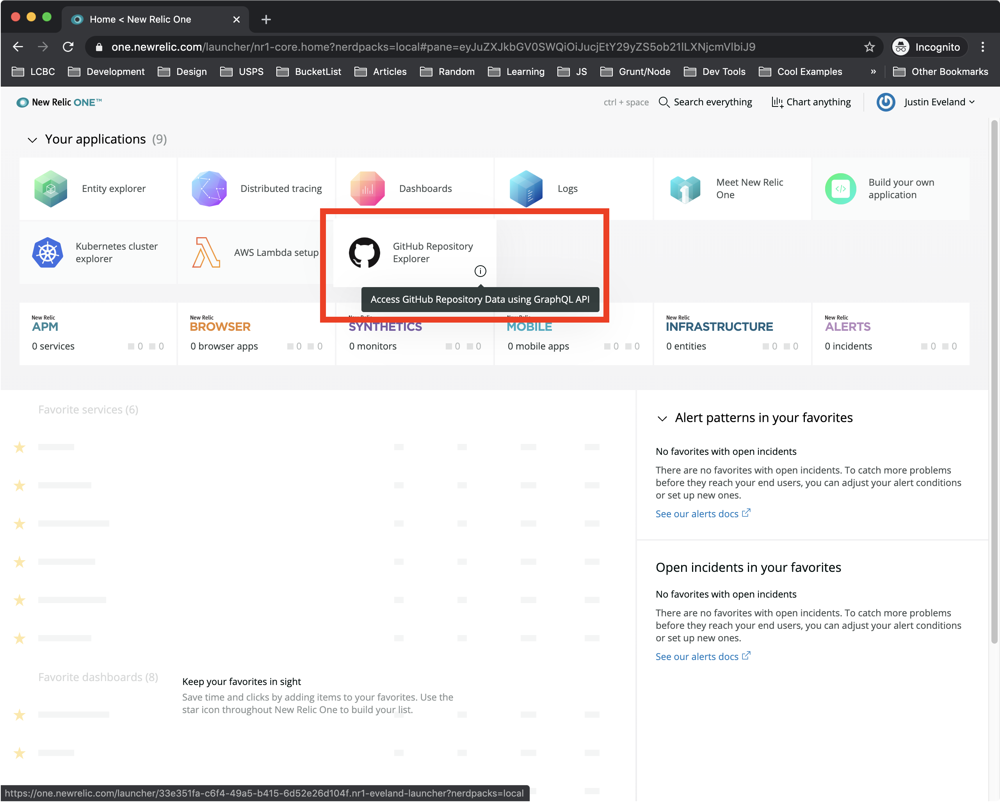
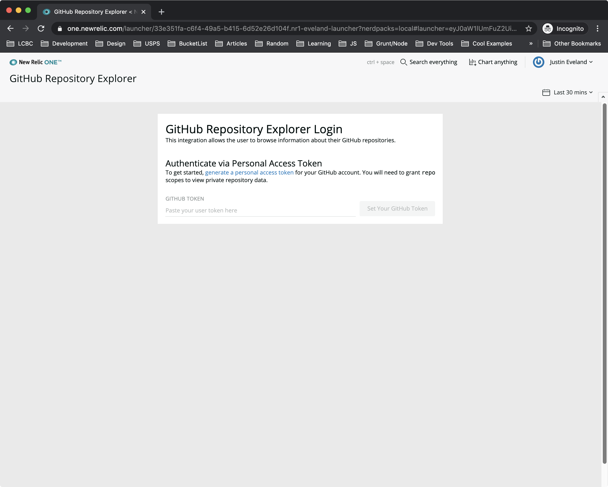
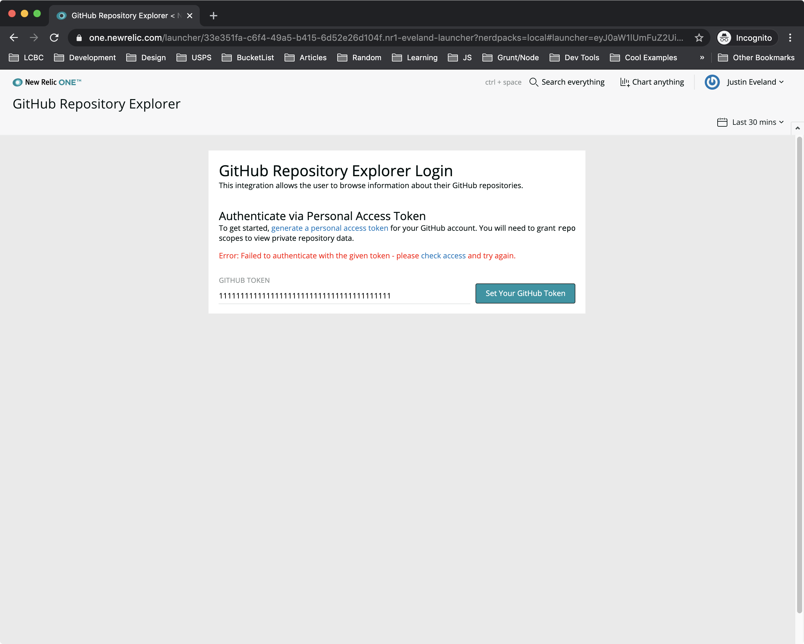
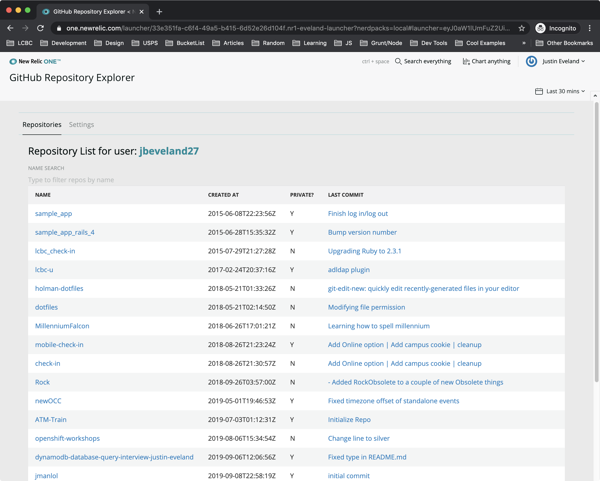
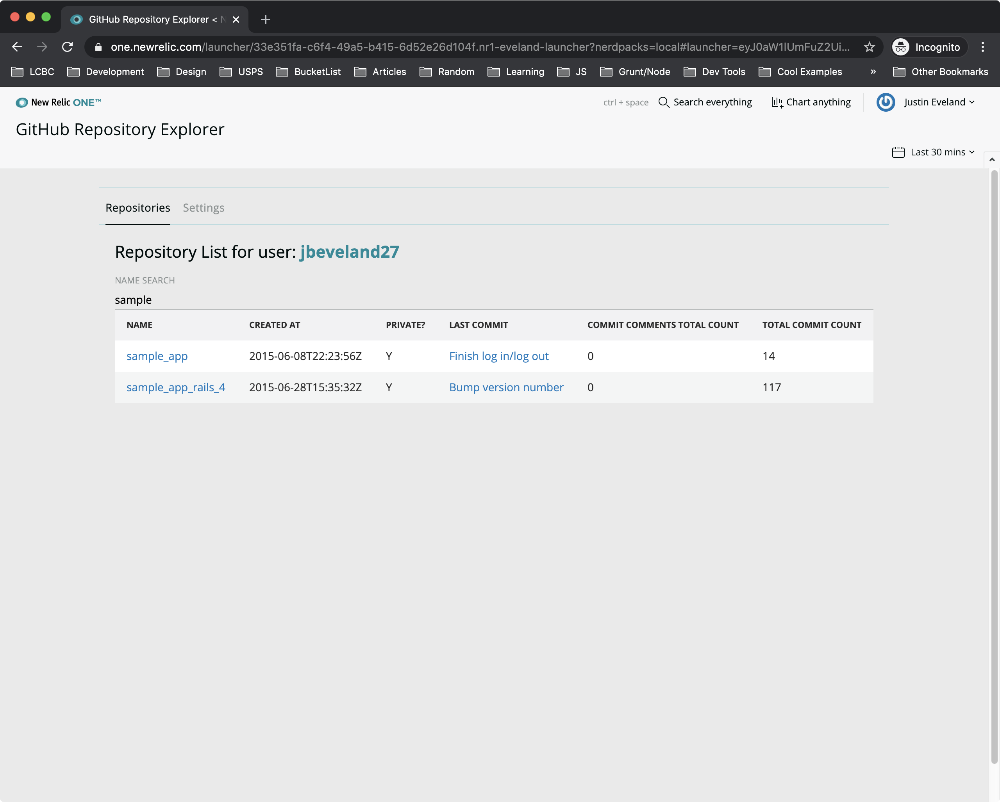
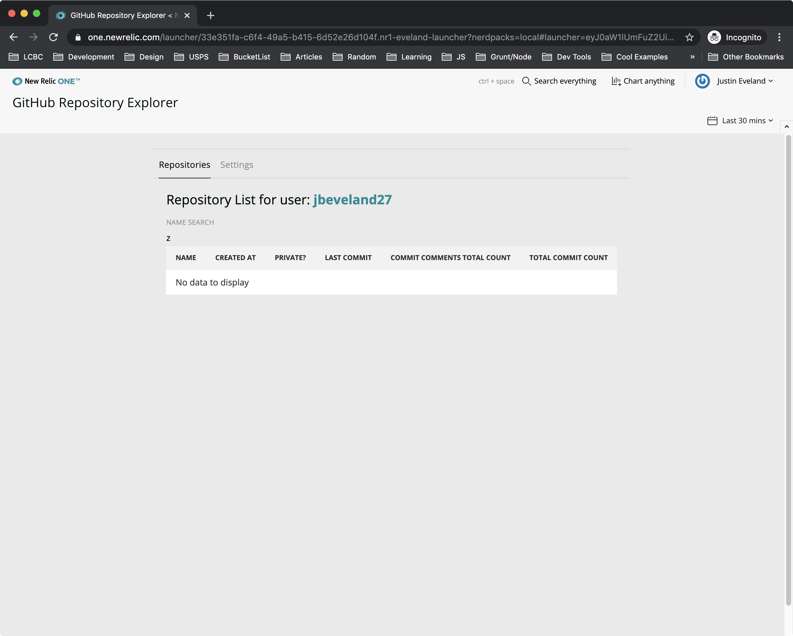
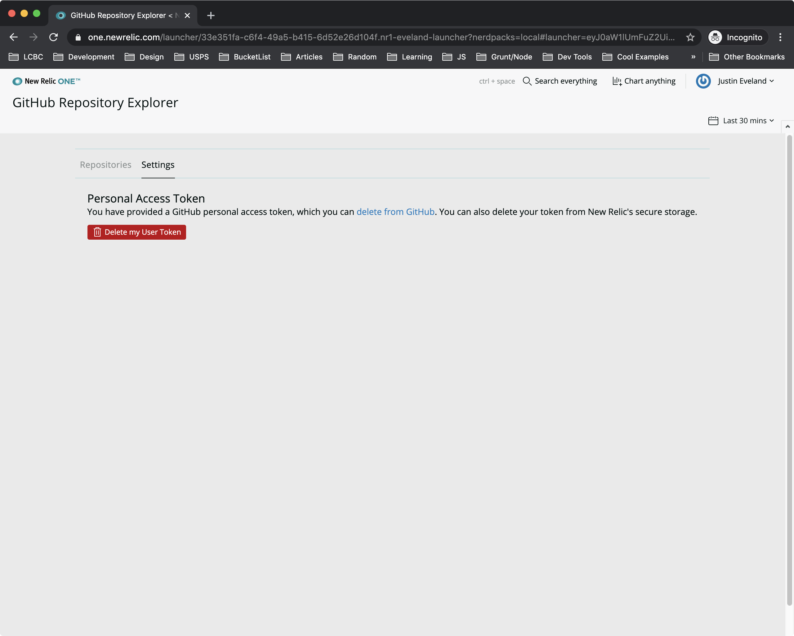

# New Relic One - GitHub Repository Explorer

Table of Contents

- [New Relic One - GitHub Repository Explorer](#New-Relic-One---GitHub-Repository-Explorer)
  - [Objective](#Objective)
  - [Usage](#Usage)
  - [Getting Started](#Getting-Started)
    - [Prerequisites](#Prerequisites)
    - [Clone Repository](#Clone-Repository)
    - [Install Dependencies and Run](#Install-Dependencies-and-Run)
  - [Screenshots](#Screenshots)
  - [Notes](#Notes)

## Objective

Create a New Relic One application that leverages platform features and queries the GitHub GraphQL API for repository information.

## Usage

This integration for the New Relic One platform adds the ability to browse repositories directly within New Relic One. This application leverages the GitHub GraphQL API, so users need to create a [Personal Access Token](https://help.github.com/en/articles/creating-a-personal-access-token-for-the-command-line) in order to authenticate. This token will be stored securely with New Relic One's [`NerdStorage`](https://developer.newrelic.com/build-tools/new-relic-one-applications/nerdstorage) API.

It's recommended to create a dedicated personal access token with `readonly` permissions for use with this application. Instructions can be found [here](https://help.github.com/en/articles/creating-a-personal-access-token-for-the-command-line).

## Getting Started

### Prerequisites

Download the [New Relic One CLI](https://developer.newrelic.com/build-tools/new-relic-one-applications/cli)

### Clone Repository

```bash
git clone https://github.com/jbeveland27/nr1-github-repository-explorer.git
```

### Install Dependencies and Run

```npm
npm install
npm start
```

Visit https://one.newrelic.com/?nerdpacks=local and :sparkles:

## Screenshots

Launcher:


Authentication:


Authentication Error Flow:


Repositories View:


Filtering Repositories:


Filtering Repositories - No Results:


Deleting Token from NerdStorage:


## Notes

- This project borrowed some ideas and code present in the [nr1-github](https://github.com/newrelic/nr1-github) and [nr1-workshop](https://github.com/newrelic/nr1-workshop) projects. I have made refernces in the code to where things were borrowed to give proper attribution.
- The GraphQL query given with the assignment is still present in the project [here](./nerdlets/nr1-github-repository-explorer-nerdlet/graphql/Queries.js). I elected to extend it a bit to gather some more data for display in the table.
- Apollo GraphQL was chosen for interacting with the GitHub GraphQL API as it's the industry-standard GraphQL client and has a robust feature set. It was only used here for two API calls, but it's flexibility would be useful in the future if this project were to be extended to interact with more GraphQL data.
